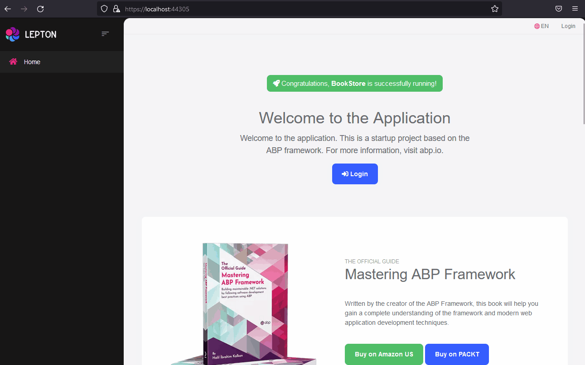

# Blazor WebAssembly Asp.NET Core Hosted

Microsoft provides a template named Blazor WebAssembly Asp.NET Core Hosted. This template is a Blazor WebAssembly application that hosts a Blazor WebAssembly application. Basically, `HttpApi.Host` and `Blazor` applications are hosted together. In this case, only one application will be deployed and blazor application will be served by the HttpApi.Host.

## Instructions

- Create a new ABP Application with Blazor UI

    ```bash
    abp new BookStore -u blazor -t app -v 6.0.0-rc.2 --no-random-port
    ```

- Add Blazor project reference and `Microsoft.AspNetCore.Components.WebAssembly.Server` package reference to the HttpApi.Host project.
    ```xml
    <ItemGroup>
        <ProjectReference Include="..\BookStore.Blazor\BookStore.Blazor.csproj" />
        <PackageReference Include="Microsoft.AspNetCore.Components.WebAssembly.Server" Version="6.0.8" />
    </ItemGroup>
    ```

- Add Blazor framework files middleware into **OnApplicationInitializaiton** method in `BookStoreHttpApiHostModule.cs` file.
    ```cs
    public override void OnApplicationInitialization(ApplicationInitializationContext context)
    {
        // ...

        app.UseBlazorFrameworkFiles(); // 👈 Make sure it's before UseStaticFiles()

        app.UseStaticFiles();

        // ...
    }
    ```

- Add a mapping for fallback to index.html file at the end of the **OnApplicationInitializaiton** method in `BookStoreHttpApiHostModule.cs` file.

    ```cs
    if (app is WebApplication webApp)
    {
        webApp.MapFallbackToFile("index.html");
    }
    ```

- Configure your blazor SelfUrl as HttpApi.Host URL in `BookStore.Blazor/wwwroot/appsettings.json`

    ```json
    {
        "App": {
            "SelfUrl": "https://localhost:44305"
        },
        "AuthServer": {
            "Authority": "https://localhost:44305",
            "ClientId": "BookStore_Blazor",
            "ResponseType": "code"
        },
        "RemoteServices": {
            "Default": {
            "BaseUrl": "https://localhost:44305"
            }
        },
        "AbpCli": {
            "Bundle": {
            "Mode": "BundleAndMinify", /* Options: None, Bundle, BundleAndMinify */
            "Name": "global",
            "Parameters": {

                }
            }
        }
    }
    ```	

- Configure DbMigrator too. Navigate to `BookStore.DbMigrator/appsettings.json` and change Blazor URL to HttpApi.Host URL.

    ```json
    {
        "ConnectionStrings": {
            "Default": "XXX"
        },
        "OpenIddict": {
            "Applications": {
            "BookStore_Blazor": {
                "ClientId": "BookStore_Blazor",
                "RootUrl": "https://localhost:44305"
            },
            "BookStore_Swagger": {
                "ClientId": "BookStore_Swagger",
                "RootUrl": "https://localhost:44305"
            }
            }
        }
    }
```

- Run `BookStore.DbMigrator` once.

- Remove **HomeController.cs** from HttpApi.Host project to prevent `/swagger` redirection.

- Run only `BookStore.HttpApi.Host` project and see the result.

    

    As you can see, URL is `localhost:44305` for blazor application and login razor page. MVC application and Blazor WebAssembly works together. As you can see swagger UI is available at `localhost:44305/swagger` too.