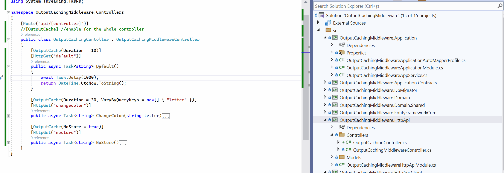

# Output Caching Middleware 
Output caching is a new middleware component included with .NET 7. Instead of calling each request, it saves `HTTP` responses. In this post, we will show its capabilities, how to use it with an ABP-based solution, and compare it to its alternatives.

Let`s create an ABP app(default) solution template and show its implementation
> abp new OutputCachingMiddleware -t app

Let`s start by configuring caching on the module file.
```csharp
public class OutputCachingMiddlewareWebModule : AbpModule
{
    public override void ConfigureServices(ServiceConfigurationContext context)
    {
        //The other configurations
        context.Services.AddOutputCache();
        //The other configurations
    }

    public override void OnApplicationInitialization(ApplicationInitializationContext context)
    {
        var app = context.GetApplicationBuilder();

        //The other configurations
        app.UseOutputCache();
        //The other configurations
    }
}
```

> Note: Please keep in mind that `UseOutputCache` must be called after `UseCors` and `UseRouting` but before `UseEndpoints`.

Now, we can create a controller under the `OutputCachingMiddleware.HttpApi` named `OutputCachingContoller`
```csharp
[Route("api/[controller]")]
public class OutputCachingContoller : OutputCachingMiddlewareController
{
    [OutputCache(Duration = 10)]
    [HttpGet("default")]
    public async Task<string> Default()
    {
        await Task.Delay(1000);
        return DateTime.UtcNow.ToString();
    }
}
```



>Note: After .NET 6, you can see the above code in minimal API but it`s used as the above for apps with controllers.

## Specify the cache key
You can store by default as described above, but you can also store based on sending parameters. This feature is available as an attribute with `VaryByQueryKeys.` There are also `VaryByHeaderNames` and `VaryByRouteValueNames` for various purposes.

Let`s continue under the same controller and create a new action to demonstrate it.
```csharp
[OutputCache(Duration = 30, VaryByQueryKeys = new[] { "letter" })]
[HttpGet("changecolon")]
public async Task<string> ChangeColon(string letter)
{
    await Task.Delay(1000);
    return DateTime.UtcNow.ToString().Replace(":", letter);
}
```


## Disable cache
To disable caching, you can remove the attribute on the action, however, if you use `[OutputCache]` for the whole controller, you must use the way below. 

Let`s see the code
```csharp
[OutputCache] //enables the whole controller
public class OutputCachingContoller : OutputCachingMiddlewareController
{
    [OutputCache(NoStore = true)]//only disable this action
    [HttpGet("nostore")]
    public async Task<string> NoStore()
    {
        await Task.Delay(1000);
        return DateTime.UtcNow.ToString();
    }
}
```


## Some default policies
* HTTP 200 responses (the successful responses) are cached and the others aren`t.
* HTTP GET or HEAD requests are cached and the other HTTP methods aren`t.
* Responses that set cookies aren`t cached.
* Responses to authenticated requests aren`t cached.

Even so, you can override the following policies.

```csharp
public override void ConfigureServices(ServiceConfigurationContext context)
{
    builder.Services.AddOutputCache(options =>
    {
        options.AddBasePolicy(builder => builder.Cache());
    });

    context.Services.AddOutputCache(); // or you can make default 
}
```

## The Differences with response caching
It differs from [response caching](https://learn.microsoft.com/en-us/aspnet/core/performance/caching/overview?view=aspnetcore-7.0#response-caching) with the following features

* The output cache behaviour is configurable on the server, the response cache uses the browser's cache.
* The output cache entries can be programmatically invalidated, the response cache doesn`t support that.
* The output cache gets just the successful responses but the response cache stores even if the response is bad.
* The output cache storage medium is extensible.

## Source Code

- You can find the full source code of the example application [here](https://github.com/abpframework/abp-samples/tree/master/OutputCachingMiddleware).

## See Also

- [What's new in ASP.NET Core 7.0](https://learn.microsoft.com/en-us/aspnet/core/release-notes/aspnetcore-7.0?view=aspnetcore-7.0#output-caching-middleware)
- [Output caching middleware in ASP.NET Core](https://learn.microsoft.com/en-us/aspnet/core/performance/caching/output?view=aspnetcore-7.0)